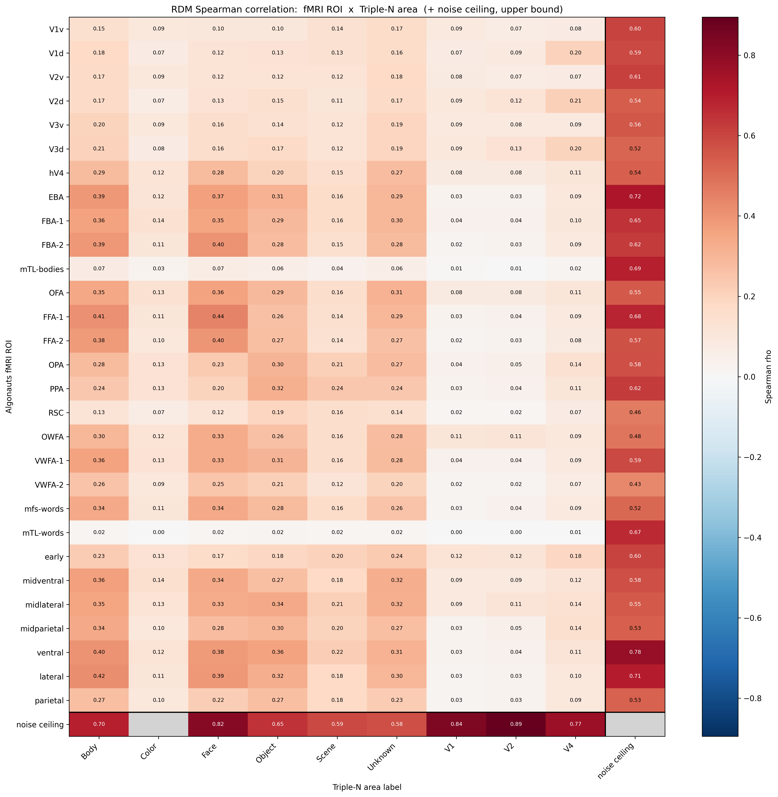

# ABSTRACT

It has been proposed that the ventral visual stream progressively "untangles" object representation manifolds, culminating in linearly-separable representations in IT cortex [1]. Recent work has shown a correspondence between the individual latent units in a beta-VAE and individual neurons in macaque IT [2] suggesting a possible learning mechanism underlying ventral visual stream transformations. Prior influential work has shown superior representational alignment with both human fMRI and macaque single unit recording in deep supervised versus unsuperised models [3]. This paper, however, being from 2014, does not test beta-VAEs, and amazingly doesn't test any unsupervised models at all. Given the advanced in the field in models, datasets, and methods, we posit that it may be time to revisit the comparison between unsupervised and deep supervised models in their ability to explain IT cortical representations. Utilizing newly published data of single unit recordings in macaque IT cortex while viewing natural scenes [4] in combination with human fMRI recordings while viewing the same images [5], we tackle this question. We hypothesize that beta-VAEs will align more closely with single unit macaque recordings, highlighting the limitations of fMRI and the need for the fusion of datasets in studying ventral visual stream representations.

# RESULTS

# REFERENCES

[1] J. J. DiCarlo, D. Zoccolan, and N. C. Rust, “How Does the Brain Solve Visual Object Recognition?,” Neuron, vol. 73, no. 3, pp. 415–434, Feb. 2012, doi: 10.1016/j.neuron.2012.01.010.

[2] I. Higgins et al., “Unsupervised deep learning identifies semantic disentanglement in single inferotemporal face patch neurons,” Nat Commun, vol. 12, no. 1, p. 6456, Nov. 2021, doi: 10.1038/s41467-021-26751-5.

[3] S.-M. Khaligh-Razavi and N. Kriegeskorte, “Deep Supervised, but Not Unsupervised, Models May Explain IT Cortical Representation,” PLOS Computational Biology, vol. 10, no. 11, p. e1003915, Nov. 2014, doi: 10.1371/journal.pcbi.1003915.

[4] Y. Li et al., “Triple-N dataset: large-scale fMRI-guided dense recordings of nonhuman primate neural responses to natural scenes,” Nat Neurosci, Jun. 2026, doi: 10.1038/s41593-026-02322-z.

[5] E. J. Allen et al., “A massive 7T fMRI dataset to bridge cognitive neuroscience and artificial intelligence,” Nat Neurosci, vol. 25, no. 1, pp. 116–126, Jan. 2022, doi: 10.1038/s41593-021-00962-x.
